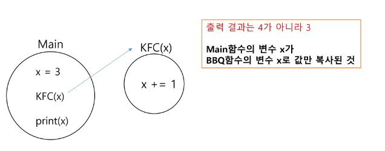

## 반복(Iteration)과 재귀(Recursion)
- 반복과 재귀는 유사한 작업을 수행할 수 있다.
- 반복은 수행하는 작업이 완료될 때 까지 계속 반복
  - 루프 (for, while 구조)
  - 반복문은 코드를 n번 반복시킬 수 있다.
- 재귀는 주어진 문제의 해를 구하기 위해 동일하면서 더 작은 문제의 해를 이용하는 방법
  - 하나의 큰 문제를 해결할 수 있는 (해결하기 쉬운) 더 작은 문제로 쪼개고 결과들을 결합한다.
  - 재귀호출은 n 중 반복문을 만들어낼 수 있다.

### 재귀를 연습하기 전, 알아야 할 함수의 특징 1
- KFC 함수 호출할 때, int 타입 객체를 전달하면 값만 복사가 된다.
- 아래 예시에서, main 함수의 x와, KFC함수의 x는 서로 다른 객체이다. (마치 한국 사는 KIM과 미국 사는 KIM이 이름만 같고, 서로 다른 사람인 것 처럼)

### 재귀를 연습하기 전, 알아야 할 함수의 특징 2
- 함수가 끝나면, Main으로 되돌아 오는 것이 아니라, 해당 함수를 호출했던 곳으로 돌아온다.

## 순열(Permutation)
### 순열이란?
- 서로 다른 N 개에서, R개를 중복없이, 순서를 고려하여 나열하는 것.
- 예시)
  - [0][1][2] 로 구성된 3장의 카드가 다량으로 존재한다.
  - 이 중에 2장을 뽑아, 순열을 나열하라. (순열은 중복을 취급하지 않는다.)
### 중복순열이란?
- 서로 다른 N 개에서, R개의 중복을 허용하고, 순서를 고려하여 나열하는 것.
- 예시)
  - [0][1][2] 로 구성된 3장의 카드가 다량으로 존재한다.
  - 이 중에 2장을 뽑아, 중복순열을 나열하라

### [참고]
문제를 마주쳤을 때 순서대로 생각해보자.

0.  문제를 잘 읽어야 한다. (계약서)
	- 숨겨진 규칙들이 없는가??
1. 완전 탐색
	- 단순 반복문 + 조건문으로 구현이 가능한가?
	- 재귀 호출로 모든 경우를 본다면?
-------------------------- 시간, 공간이 부족하다
2. 규칙성을 찾는다.
	- 문제에 숨겨진 규칙이나 패턴 (예시를 잘보자)
	- 순간마다 최선의 선택이 정답이다 (Greedy)

3. 재계산을 하지 말자
	- 중복되는 문제의 결과를 저장해놓고 재활용하자 (DP)

--------------------------------- 그래프

4. 전체 노드를 탐색하자.
	- DFS : 가능한 경우 끝까지 탐색하면서 나아가자
	- BFS : 내 기준으로 퍼져나가면서 탐색하자

---------------------------------- 음?? N이 너무 크다

- 새로운 알고리즘이나 자료구조를 고민해야하는 단계

------------ 알고리즘
5. 재귀 호출 접근법의 경우
	- 백트래킹 (가지치기)

6. 정렬하자 (sort)
	- 최소값/ 구간, 최대값/구간 등
	- 내장 함수  sort() - O(NlogN)이 보장됨
	- 탐색해야 한다 : 이진 탐색

7. 심화 문제들
	- 최단 거리 : dijkstra
	- 최소 비용 : MST

----  자료구조
- 한 번 만들어 놓고 여러 번 조회한다.

- 이진 탐색 트리
- 힙 (우선순위 큐)
- 그룹화 (UNION-FIND)
- Trie, segment tree ...