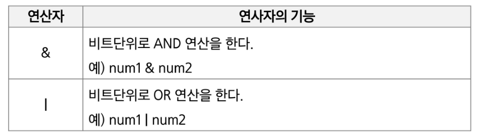
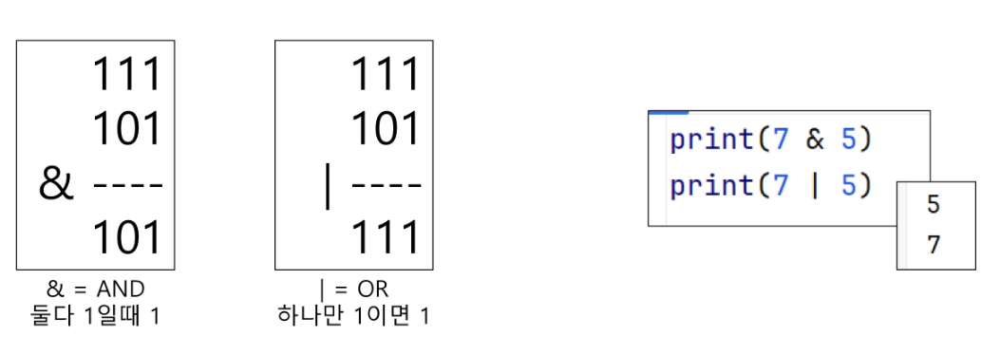
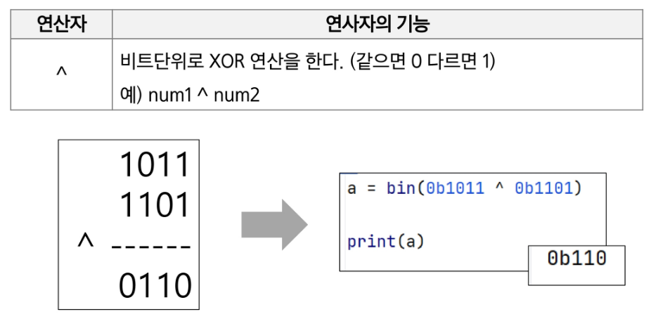
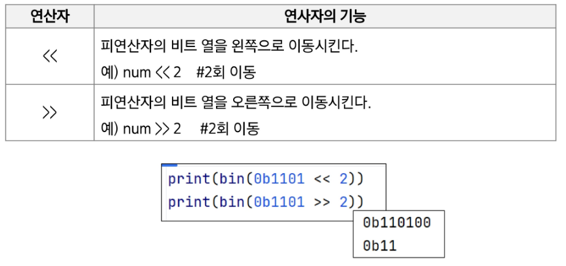
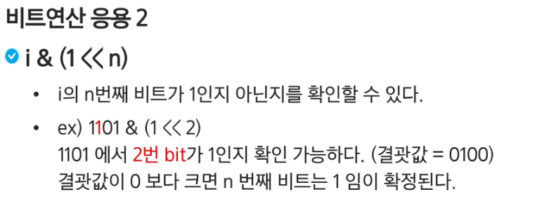
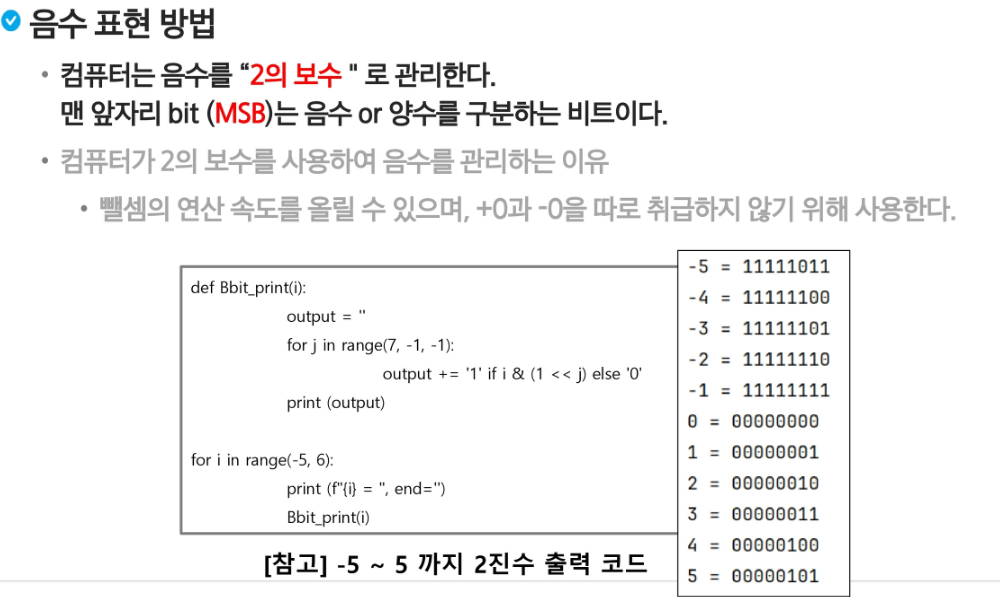
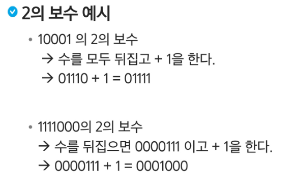
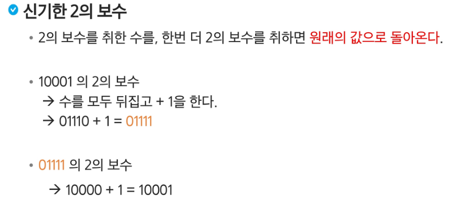
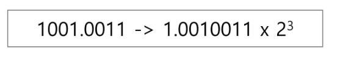

## 비트 연산

### 비트와 바이트
- 1 bit : 0과 1을 표현하는 정보의 단위
- 1 Byte : 8-bit를 묶어 1 Byte라고 한다.

### 예시
- 1001011011011100 은 총 몇 비트이면서, 몇 바이트 인가? 16비트, 2바이트

### 비트연산
- 컴퓨터의 CPU는 0과 1로 다루어 동작되며, 내부적으로 비트 연산을 사용하여 덧셈, 뺄셈, 곱셈 등을 계산한다.

### 비트연산 챕터의 목적
- 사람이 사용하는 사칙연산 (+,*,/,-)이 아닌 컴퓨터가 사용하는 연산인 '비트연산'을 이해해본다.
- 더 나아가, 프로그래밍에서 비트연산을 활용한 코딩 방법을 익혀본다.

### AND와 OR 비트연산자 이해하기
- a AND b : a, b 둘 다 1 일때만 결과가 1이다. 그 외에는 0
- a OR b : a, b 둘중 하나만 1이면 결과가 1이다. 그 외에는 0



### 파이썬 구현
- 7 & 5 -> 이진수로 표현하면 0b111 & 0b101



### 파이썬에서 2진수, 16진수, 10진수 변환하여 출력하기
- 2진수는 숫자 0과 소문자 b -> 0b를 접두사로 붙여 표현한다.
- 16진수는 숫자 0과 소문자 x -> 0x를 접두사로 붙여 표현한다.

### XOR 와 NOT 연산자
- ^ : XOR(엑스오어) 연산자, OR 처럼 동작되는데 둘 다 1인 경우는 0 이다.



### 신기한 XOR
- 어떤 값이던 특정 수로 2회 XOR를 하면 원래 수로 돌아온다.

### 비트 연산자
- Left Shift << : 특정 수 만큼 비트를 왼쪽으로 밀어낸다. 
  - 왼쪽으로 갈 데가 없으면 오른쪽에 0 추가
  - 2진수 기준 왼쪽 한칸 -> 2배
- Right Shift >> : 특정 수 만큼 비트를 오른쪽으로 밀어낸다. (우측 비트들이 제거된다.)
  - 오른쪽으로 갈 데가 없으면, 비트 삭제
  - 진수 기준 오른쪽 한칸 -> 2로 나눈 몫


### 참고
- 반복문 vs 재귀함수 : 연산 횟수가 동일할 때 반복문이 더 효율적

- 5 + (-5) 뺄셈을 사용하지 말자!
  1. 부호 비트만 사용
    - 숫자 표현엔 문제가 x
    - 연산자 사용 시에 문제가 발생

  2. 1의 보수
    - 각 비트를 뒤집어서 표현하자.
    - 문제점 : 0을 표현하는 방법이 2개가 생김 (0000 0000, 1111 1111)

  3. 2의 보수 (채택)
    - 각 비트를 모두 뒤집고 1을 더하자
      - 덧셈 연산 시 over bit는 삭제








### bitwise NOT(complement)  연산자
- ~ 연산자 : 모든 비트를 반전시킨다.
- 만약 8-bit 일때 ~(0001 1111) 이라면 값은 1110 0000 이 된다.

### Bitwise NOT 연산자를 파이썬에서 수행하기
- 파이썬에서는 ~4를 수행하면 -5가 출력된다.

### 파이썬이 ~4를 -5로 출력하는 과정
- 4는 0b0100이다. (MSB : 양수이므로 0)
- NOT 연산자로 인해 뒤집으면 1011 이 된다.
- MSB는 1이 되었고 (음수), 나머지 bit는 011 이다.
- 나머지 bit에 대해 2의 보수를 취하면 100 + 1 = 101 이므로 5가 된다.
- 따라서 -5가 된다.

### 비트마스킹

```
mask = (1 << N) - 1 : 연속된 N개의 1
```

## 실수

### 파이썬에서 실수 출력 방법
- 파이썬은 f-string 문법을 지향한다.

### 소수점 출력 방법
- {t2:.2f} : t2값을 소수점 둘째자리에서 반올림하여 표현
```
t1 = 10
t2 = 3.141592

print(f'변수 값은 {t1} 입니다') - 변수 값은 10 입니다.
print(f'변수 값은 {t2:.2f} 입니다') - 변수 값은 3.14 입니다.
```

### 파이썬에서의 실수 표현 범위를 알아보자
- 파이썬에서는 다른 언어와 달리 내부적으로 더 큰 규모의 자료구조를 사용해서 훨씬 넓은 범위의 실수를 표현할 수 있다.
- 최대로 표현할 수 있는 값은 약 1.8 X 10^308이고 이 이상은 inf로 표현 (참고로 1억은 1 X 10^8임)
- 최소로 표현할 수 있는 값은 약 5.0 X 10^-324 이며, 이 이하는 0으로 표현

### 컴퓨터는 실수를 내부적으로 근사적으로 관리한다.
- 실수는 정확한 값이 아니라 근사 값으로 저장되는데 이때 생기는 작은 오차가 계산 과정에서 다른 결과를 가져온다.

### 실수의 표현
- 컴퓨터는 실수를 표현하기 위해 부동 소수점(floating-point) 표기법을 사용한다. 이 표기법은 IEEE 754 이라는 컴퓨터에서 부동소수점을 표기하는 국제표준이다.
- 부동 소주점 표기 방법은 소수점의 위치를 고정시켜 표현하는 방식이다. 소수점의 위치를 왼쪽의 가장 유효한 숫자 다음으로 고정시키고 밑수의 지수승으로 표현



### 실수를 저장하기 위한 형식 (IEEE 754, 32bit-Single Precision 표기법 기준)
- 32bit 구조

  - 부호 1비트 : 0이면 양수, 1이면 음수
  - 지수부(exponent) : 부동소주점의 크기 + bias값
  - 가수부(mantissa) : 실질적 수

### 12.375 를 부동소주점으로 표기
- 12.375를 2진수로 변환 : 12는 1100, 0.375는 0.011이므로 1100.011
- 1100.011 = 1.10011 * 2^3 즉, 가수는 100011이고, 지수는 3. (맨 앞 1은 생략)

### 지수 + bias : IEEE 754는 bias를 더한 결과로 표기
- 3 + 127(bias) = 130 (2진수로는 10000010)

### 12.375 를 IEEE754로 표기하는 방법
- 부호 비트 : 0 (양수)
- 지수 : 10000010
- 가수 : 10001100000000000000000

### 컴퓨터는 실수를 근사적으로 표현한다.
- 이진법으로 표현 할 수 없는 형태의 실수는 정확한 값이 아니라 근사 값으로 저장되는데 이때 생기는 작은 오차가 계산 과정에서 다른 결과를 가져온다.
- 문제 풀이시 반올림 계산 or 버림 계산하기.

### 실수 자료형의 유효 자릿수를 알아 두자.
- 32 비트 실수형 유효자릿수(십진수) -> 약 6 자리 (C++)
- 64 비트 실수형 유효자릿수(십진수) -> 약 15 자리 (C++, Java)
- 파이썬에서는 내부적으로 더 많은 비트를 사용해서 훨씬 넓은 범위의 실수를 표현할 수 있다.


### 전체 정리
- 컴퓨터의 연산을 이해하는 시간
- 비트를 활용하는 방법

1. 비트 연산
  - 연산자 ( &, |, ^, <<, >> )
  - 부분 집합 문제 등의 활용 방안
  - [추천] 다양한 활용 방법 GPT 검색

2. 실수
  - 컴퓨터의 실수 저장 및 활용 방법
  - [주의사항] 근사치로 인한 오차 조심
    - 반올림, 버림 등 문제를 잘 읽자.