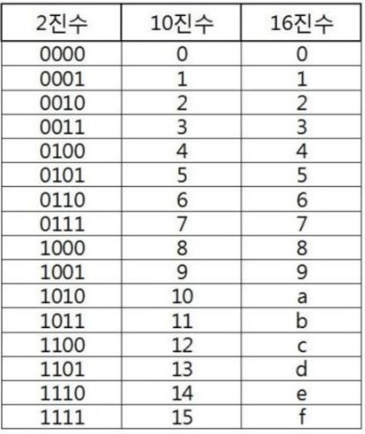

# Start1

## SW 문제 해결

### SW 문제 해결 역량이란 무엇인가?
- 프로그램을 하기 위한 많은 제약 조건과 요구사항을 이해하고 최선의 방법을 찾아내는 능력
- 프로그래머가 사용하는 언어나 라이브러리, 자료구조, 알고리즘에 대한 지식을 적재적소에 퍼즐을 배치하듯 이들을 연결하여 큰 그림을 만드는 능력이라 할 수 있다.
- 문제 해결 역량은 추상적인 기술이다.
  - 프로그래밍 언어, 알고리즘처럼 명확히 정의된 실체가 없다.
  - 무작정 알고리즘을 암기하고 문제를 풀어본다고 향상되지 않는다.
- 문제 해결 역량을 향상시키기 위해서 훈련이 필요하다.

### 문제 해결 과정
1. 문제를 읽고 이해한다.
2. 문제를 익숙한 용어로 재정의 한다.
3. 어떻게 해결할지 계획을 세운다.
4. 계획을 검증한다.
5. 프로그램으로 구현한다.
6. 어떻게 풀었는지 돌아보고, 개선할 방법이 있는지 찾아본다.

### 리스트에 숫자 넣기
- 수 N을 입력 받는다.
- 윗 줄에는 N부터 1씩 증가되는 숫자 4개 왼쪽에 채운다.
- 아랫 줄에는 N 부터 1씩 감소되는 숫자 4개 오른쪽에 채운다.
- 최종 결과를 출력한다. 빈 공간은 0으로 출력한다.

### SW 문제 해결 능력을 기르는 이유
- 코딩을 더 잘하게 하는 능력을 기르기 위함.
- SWEA 문제를 통해 기본문법&자료구조&알고리즘을 더 능숙하게 쓸 수 있도록 훈련한다.

### SWEA 문제를 잘 풀기 위한 전략
- 단계 1: 완벽한 문제 이해
- 단계 2: 종이와 펜을 이용한 설계하기 (어떻게 구현할지 계획하기)
- 단계 3: 설계한대로 구현 & 디버깅을 한다.

## 복잡도 분석

### 알고리즘?
- (명) 알고리즘: 유한한 단계를 통해 문제를 해결하기 위한 절차나 방법이다. 주로 컴퓨터용어로 쓰이며, 컴퓨터가 어떤 일을 수행하기 위한 단계적 방법을 말한다.
- 간단하게 다시 말하면 어떠한 문제를 해결하기 위한 절차라고 볼 수 있다.
- 예를 들어 1쿠터 100까지의 합을 구하는 문제를 생각해보자.
  - ex1) 1 + 2 + 3 + 4 + ... + 100 = 5,050
  - ex2) 100 * (1+100) / 2 = 5,050 (한 칸씩 옮겨가며 양 끝을 더한게 전부 101, 이게 50개가 있음.)

### 알고리즘의 효율
- 공간적 효율성과 시간적 효율성
  - 공간적 효율성은 연산량 대비 얼마나 적은 메모리 공간을 요하는 가를 말한다.
  - 시간적 효율성은 연산량 대비 얼마나 적은 시간을 요하는 가를 말한다.
  - 효율성을 뒤집어 표현하면 복잡도(Complexity)가 된다. 복잡도가 높을수록 효율성은 저하된다.

### 복잡도의 점근적 표기
- 시간 (또는 공간) 복잡도는 입력 크기에 대한 함수로 표기하는데, 이 함수는 주로 여러개의 항을 가지는 다항식이다.
- 이를 단순한 함수로 표현하기 위해 점근적 표기 (Asymptotic Notation)를 사용한다.
- 입력 크기 n이 무한대로 커질 때의 복잡도를 간단히 표현하기 위해 사용하는 표기법이다.
  - O(Big-Oh) -표기
  - Ω(Big-Omega) -표기
  - Θ(Big-Theta) -표기

### O(Big-Oh) -표기
- O-표기는 복잡도의 점근적 상한을 나타낸다.
- 복잡도가 f(n) = 2n^2 - 7n + 4 이라면, f(n)의 O-표기는 O(n^2)이다.
- 먼저 f(n)의 단순화된 표현은 n^2이다.
- 단순화된 함수 n^2에 임의의 상수 c를 곱한 cn^2이 n이 증가함에 따라 f(n)의 상한이 된다. (단, c>0.)

### 빅오표기법을 이렇게 표현하기도 합니다.
- O(5N)
- 5배수 강조해서 표현하고 싶을 때, O(N)이라고 적지 않고, O(5N) 이라고 적곤 합니다.

## <플러스 알파!>

### 코딩테스트에서 복잡도를 어떻게 활용할까?

- **시간초과** -> 설계 단계에서 방지하는 방법!
- python 언어 기준 : 대략 1초 당 3,000만 번 ~ 4,000만 번 연산

    -> N의 범위 -> 10,000이다!
    - N^2 = 1억 번 (Python 기준 대략 3초)
      - NlogN = 130,000 ~ 140,000
      - 넉넉하구나

- 공간 - getsizeof

## 진수(진법)

### 2진수, 8진수, 10진수, 16진수
- 10진수 : 사람이 사용하는 진수, 수 하나를 0 ~ 9로 표현
- 2진수 : 컴퓨터가 사용하는 진수, 수 하나를 0, 1로 표현
- 8진수 : 2진수를 더 가독성있게 사용
- 16진수 : 2진수를 더 가독성있게 사용, 수 하나를 0, 1, ..., 8, 9, A, B, C, D, E, F 로 표현

### 왜 16진수를 사용하는 것인가?
- 2진수를 사람이 이해하기 편하도록 10진수로 변환 시
  - 인간이 이해하기 편하지만, 연산이 오래 걸림
- 2진수를 사람이 이해하기 편하도록, 16진수로 변환 시
  - 인간이 이해하기 어렵지만, 연손 속도가 매우 빠름

### 앞으로 학습 목표
1. 2진수, 10진수, 16진수를 왜 쓰는지 이해한다. (완료)
2. 손으로 변환하는 방법을 익힌다.
3. 프로그래밍으로 진수 변환을 직접 구현한다.

## 진법 변환

### 10진수 -> 타 진수로 변환
- 원하는 타진법의 수로 나눈 뒤 나머지를 거꾸로 읽는다.
- 예제) 149(10) = 10010101(2) = 225(8) = 95(16)

